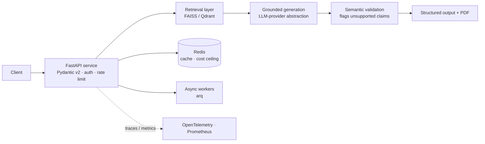

# Production RAG Platform


**Evidence-grounded LLM generation, built as a production service — not a notebook.**

A retrieval-augmented generation platform that grounds every generated claim in the user's
own input, served behind a typed API with full production infrastructure: containerized,
Kubernetes-deployable, observable, and CI/CD-gated.

### ▶ Live demo — **[resumeforge-bg29.onrender.com](https://resumeforge-bg29.onrender.com)**
*(Render free tier — the first request after idle cold-starts in ~30s.)*

> **What this repository is.** It documents the **architecture, deployment, and delivery
> pipeline** of a system that runs in production (demo above). The application's evaluation
> algorithms and domain business logic are intentionally **not** published. The reusable
> infrastructure layer — the vendor-neutral LLM-provider and vector-store abstractions —
> *is* open-sourced, with runnable code and tests, at
> **[rag-llm-infra](https://github.com/MarwaBS/rag-llm-infra)**.

## System overview



## Components

| Component | Responsibility | Stack |
|---|---|---|
| **API gateway** | Typed request/response, authentication, rate limiting | FastAPI, Pydantic v2, slowapi |
| **Retrieval** | Grounds generation in the user's own evidence | FAISS / Qdrant, SentenceTransformers |
| **Generation** | Vendor-neutral model calls behind a protocol | OpenAI, LLM-provider abstraction |
| **Validation** | Flags generated claims not supported by the input | semantic-similarity checks |
| **State** | Caching, daily cost ceiling, async jobs | Redis, arq |
| **Observability** | Distributed traces, metrics, structured logs | OpenTelemetry, Prometheus |
| **Delivery** | Image build, K8s deploy, CI/CD | Docker, Helm, GitHub Actions |

*Descriptions are intentionally architectural — the implementation is private.*

## Tech stack

**Service:** Python 3.12 · FastAPI · Pydantic v2 · Uvicorn · slowapi
**LLM / RAG:** OpenAI API · FAISS / Qdrant · SentenceTransformers · vendor-neutral LLM protocol
**State & async:** Redis · arq
**Observability:** OpenTelemetry (traces) · Prometheus (metrics) · structured JSON logs
**Delivery:** multi-stage Docker (non-root, Trivy-scanned) · Helm / Kubernetes · GitHub Actions · CycloneDX SBOM

## Architecture decisions

Full summaries in **[docs/decisions/](docs/decisions/)**:

- **[ADR-001](docs/decisions/001-faiss-over-managed-vector-db.md)** — FAISS over a managed vector DB (sub-ms search, zero standing infra, per-request isolation).
- **[ADR-002](docs/decisions/002-pre-grounding-over-post-filtering.md)** — Pre-grounding over post-filtering (prevention beats detection; clean audit trail).
- **[ADR-003](docs/decisions/003-circuit-breaker-for-llm-resilience.md)** — Circuit breaker for LLM resilience (fail fast, cap spend, self-heal).
- **[ADR-004](docs/decisions/004-vendor-neutral-llm-protocol.md)** — Vendor-neutral LLM protocol (model vendor is a config choice; open-sourced in `rag-llm-infra`).

## Deployment

- **Container** — multi-stage `python:3.12-slim-bookworm`, runs as a non-root user, Trivy-scanned: **[deploy/Dockerfile](deploy/Dockerfile)**.
- **Orchestration** — Helm chart with Deployment / Service / HPA / PodDisruptionBudget / Ingress / ServiceAccount and a Secret-backed config: **[deploy/helm/](deploy/helm/)**.
- **Runtime** — auto-deploys to a managed container host on merge to `main` (the live demo above).

## CI/CD

Multi-job GitHub Actions pipeline — structure documented in **[docs/ci-cd-pipeline.yml](docs/ci-cd-pipeline.yml)**:

```
lint → security scan → unit tests → integration tests → evaluation gate → helm-lint → image build + Trivy scan
```

No secrets live in source; credentials are injected via repository secrets and a Kubernetes Secret.

## License

MIT — see [LICENSE](LICENSE).
