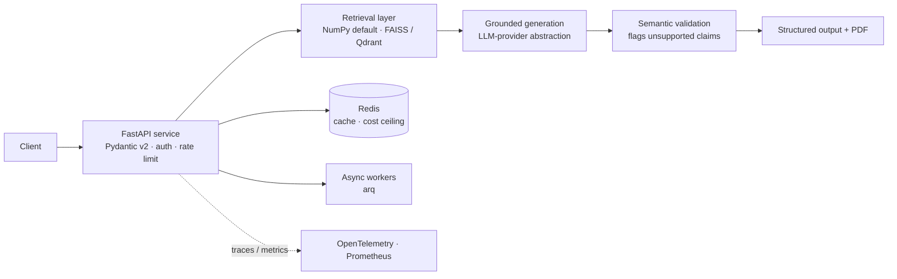

## What this is

A production RAG platform that grounds every generated claim in verified source documents — because hallucination in production costs real money.

**[Live demo](https://resumeforge-bg29.onrender.com)** · **[Open infrastructure: rag-llm-infra](https://pypi.org/project/rag-llm-infra/)**

Stack: FastAPI · LangChain · Redis · FAISS/Qdrant · Kubernetes · Helm · OpenTelemetry · Prometheus

---

# Production RAG Platform

[](../../actions/workflows/ci.yml)


**Evidence-grounded LLM generation, built as a production service — not a notebook.**

A retrieval-augmented generation platform that grounds every generated claim in the user's
own input, served behind a typed API with full production infrastructure: containerized,
Kubernetes-deployable, observable, and CI/CD-gated.

> **What runs here vs. what's design context** — the one thing to get straight:
>
> | | Runs in this repo (`app/`) | Design context only |
> |---|---|---|
> | **What** | A runnable reference RAG service on the published [`rag-llm-infra`](https://pypi.org/project/rag-llm-infra/) package | ADRs + the "full system" diagram for a separate **private** product (ResumeForge) |
> | **Includes** | typed config · auth + input validation · `/index` `/query` `/health` `/ready` `/metrics` · structured logs · Helm chart · Dockerfile | Redis cache · arq workers · OTel tracing · semantic validation · PDF output · rate limiting |
> | **Status** | real, runs locally, **CI-gated** (image build + Trivy · integration tests · Helm lint+render · hadolint · SBOM) | the proprietary generation logic is **not** in this repo |
>
> Sections below are labelled _"full system"_ when they describe the private architecture, so you
> can always tell what executes here from what's design context.

**Run it in 30 seconds** — [jump to quickstart](#run-the-reference-service). The private product
ResumeForge is live at **[resumeforge-bg29.onrender.com](https://resumeforge-bg29.onrender.com)**
(a separate codebase — *not* this service; free tier, ~30s cold start).

## Run the reference service

```bash
pip install -e .            # pulls rag-llm-infra from PyPI
uvicorn app.main:app        # or: docker build -f deploy/Dockerfile -t prap . && docker run -p 8000:8000 prap
```

```bash
curl -XPOST localhost:8000/index -d '{"documents":["FAISS vector search","Qdrant database"]}' -H 'content-type: application/json'
curl -XPOST localhost:8000/query -d '{"query":"vector search","k":1}'                          -H 'content-type: application/json'
curl localhost:8000/health    # liveness  ·  /ready readiness (503 until indexed)  ·  /metrics Prometheus
```

Runs on the NumPy vector store + Mock LLM with no API key. Set `APP_LLM_BACKEND=openai` + `OPENAI_API_KEY` for real generation.

## What this reference service implements (in this repo)

The runnable `app/` service:

- `POST /index` — build a vector store from documents and swap it in atomically
  (corpus-replace; optional `X-API-Key` when `APP_API_KEY` is set).
- `POST /query` — retrieve top-k and generate a grounded answer (Mock LLM by
  default, or OpenAI via `APP_LLM_BACKEND=openai`).
- `GET /health` — liveness · `GET /ready` — app-level "is a corpus indexed?"
  (503 until indexed) · `GET /metrics` — Prometheus.
- Typed config (pydantic-settings, validated), structured logging, input
  validation, single-replica Helm chart, multi-stage non-root Docker image.

Retrieval backend is NumPy by default (`faiss`/`qdrant` available via extras).

## System overview — full production architecture (the private system)

> The diagram and the two tables below describe the **full private product's**
> architecture, for design context. Components not listed under "What this
> reference service implements" above (Redis cache, arq workers, OpenTelemetry
> tracing, semantic validation, PDF output, rate limiting) live in that private
> codebase, **not** in this repo.



| Component | Responsibility | Stack | In this repo |
|---|---|---|---|
| **API gateway** | Typed request/response, API-key auth, validation | FastAPI, Pydantic v2 | ✅ (rate limiting: private) |
| **Retrieval** | Grounds generation in the user's own evidence | FAISS / Qdrant, SentenceTransformers | ✅ (NumPy default; FAISS/Qdrant via extras) |
| **Generation** | Vendor-neutral model calls behind a protocol | OpenAI, LLM-provider abstraction | ✅ (via `rag-llm-infra`) |
| **Validation** | Flags generated claims not supported by the input | semantic-similarity checks | ◻ private |
| **State** | Caching, daily cost ceiling, async jobs | Redis, arq | ◻ private |
| **Observability** | Metrics + structured logs (traces: private) | Prometheus; OpenTelemetry | ✅ metrics + logs · ◻ traces |
| **Delivery** | Image build + scan, SBOM, K8s deploy, CI/CD | Docker, Helm, GitHub Actions, Trivy, CycloneDX | ✅ |

## Tech stack

**In this repo (real, runs, CI-gated):** Python 3.12 · FastAPI · Pydantic v2 ·
Uvicorn · `rag-llm-infra` (NumPy / FAISS / Qdrant · vendor-neutral LLM protocol ·
OpenAI optional) · Prometheus metrics · structured JSON logs · multi-stage Docker
(non-root, Trivy-scanned) · Helm / Kubernetes · GitHub Actions · CycloneDX SBOM.

**Full system only (private architecture, not in this repo):** Redis · arq ·
OpenTelemetry traces · slowapi rate limiting · semantic validation · PDF output.

## Architecture decisions

Full summaries in **[docs/decisions/](docs/decisions/)**:

- **[ADR-001](docs/decisions/001-faiss-over-managed-vector-db.md)** — FAISS over a managed vector DB (sub-ms search, zero standing infra, per-request isolation).
- **[ADR-002](docs/decisions/002-pre-grounding-over-post-filtering.md)** — Pre-grounding over post-filtering (prevention beats detection; clean audit trail).
- **[ADR-003](docs/decisions/003-circuit-breaker-for-llm-resilience.md)** — Circuit breaker for LLM resilience (fail fast, cap spend, self-heal).
- **[ADR-004](docs/decisions/004-vendor-neutral-llm-protocol.md)** — Vendor-neutral LLM protocol (model vendor is a config choice; open-sourced in `rag-llm-infra`).

## Deployment

- **Container** — multi-stage `python:3.12.8-slim-bookworm`, runs as a non-root user, Trivy-scanned in CI: **[deploy/Dockerfile](deploy/Dockerfile)**.
- **Orchestration** — single-replica Helm chart (Deployment / Service / Ingress / ServiceAccount / Secret; HPA + PDB templates ship but are disabled by default because the index is in-process — see [values.yaml](deploy/helm/values.yaml)): **[deploy/helm/](deploy/helm/)**.
- **Image publishing** — on merge to `main`, CI builds the image and pushes `:latest` and a commit-SHA tag to GHCR. This repo does **not** auto-deploy anywhere; the live demo above is the separate ResumeForge product.

## CI/CD

**This repository's own CI** ([`.github/workflows/ci.yml`](.github/workflows/ci.yml)) runs on every push and PR:
`ruff` lint · `mypy` · `pytest` integration tests · `helm lint` + `helm template` render · `hadolint` on the
Dockerfile · Docker image build · **Trivy** image scan · **CycloneDX SBOM** generation (uploaded as an artifact).
On merge to `main` it also pushes the scanned image to GHCR.

The **private production system's** fuller pipeline (unit/integration split, an evaluation gate, etc.) is
sketched for reference in **[docs/ci-cd-pipeline.yml](docs/ci-cd-pipeline.yml)** — an illustrative document,
not an executed workflow in this repo.

No secrets live in source; credentials are injected via repository secrets and a Kubernetes Secret.

## License

MIT — see [LICENSE](LICENSE).
